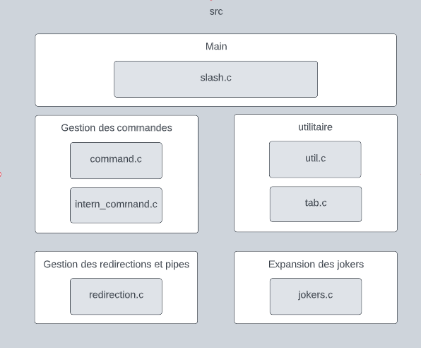

# SYSTÈME D'EXPLOITATION 2022 - 2023

## Sommaire
1. [Fonctionnalités](README.md#fonctionnalités)
2. [Architecture](README.md#architecture)
3. [Stratégie adoptée et structure logicielle](README.md#stratégie-adoptée-et-structure-logicielle)

----------------------------------------------------------------------

## Fonctionnalités

Le but du projet est de programmer un interpréteur de commandes (aka
*shell*) interactif reprenant quelques fonctionnalités plus ou moins
classiques des shells usuels

Voilà une liste de ce que peux executer slash:

1. Commande interne (`exit`, `pwd`, `cd`)
2. Commande extern
3. Expansion de `*` et `**`
4. Redirection de fichier (<, >, >|, >>)
5. Pipeline (`cmd1 | cmd2 | ... | cmdn`)

----------------------------------------------------------------------

## Architecture

**Schéma permettant de comprendre l'architecture des fichiers principaux :**

----------------------------------------------------------------------

## Stratégie adoptée et structure logicielle

**Première étape : Le prompt**

La premiere chose a faire dans ce projet est de faire le prompt, pour cela on a décidé de parser notre ligne de commande dans un tableau de chaine de caractere alloué sur la pile. pour pouvoir le tester, on a du coder les commandes internes, pwd et cd (`intern_command.c`).
Apres ça, on a du coder les commandes externes (`command.c`) et la gestions des signaux (`util.c`).
Toutes les fonctions relative a la gestion des tableau de commandes se trouve dans `tab.c`.

**Deuxième étape : Les jokers**

Apres ça on a du faire les jokers, pour `*`, nous avons fais une fonction recursive qui ajoute/remplace dans notre tableau de commande quand on traite le dernier terme, découper par rapport au `/`.
pour `**`, nous avons fais une fonction recursive qui appelle star dans les sous dossiers a partir du  repertoire courant avec les bons arguments .
La gestions des jokers se trouve dans `jokers.c`

**Troisième étape : Les redirections**

Enfin il a fallut gerer les redirection et les pipeline, pour cela nous avont du changer la façon dont on parser notre retour de readline. Nous avons décidé de parser cette chaine de caractere une premiere fois par rapport au `|` pour avoir un tableau de commande puis une deuxieme fois par rapport a ` ` pour avoir un tableau d'argument.

----------------------------------------------------------------------