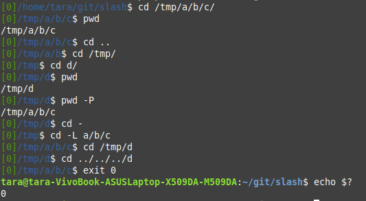
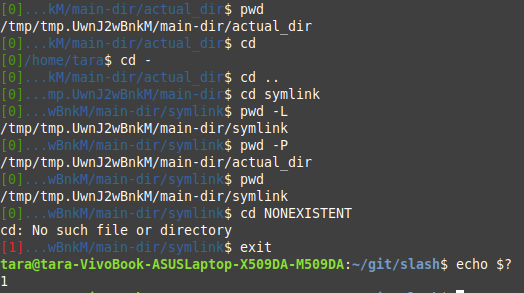
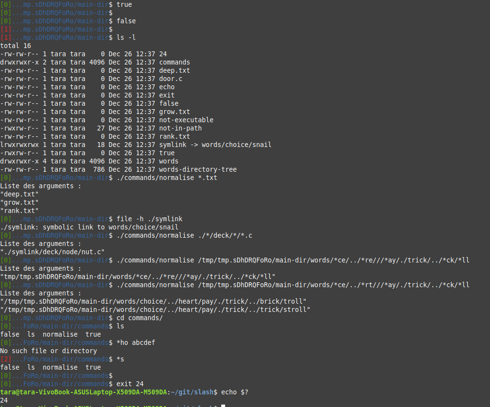
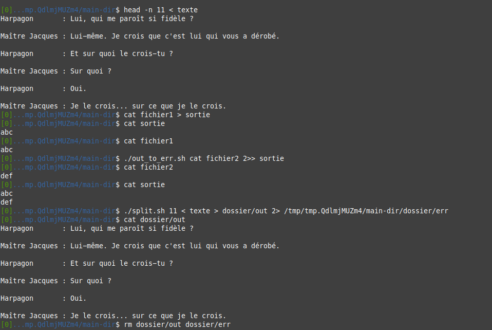
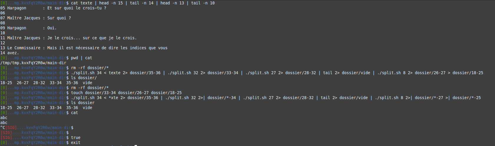
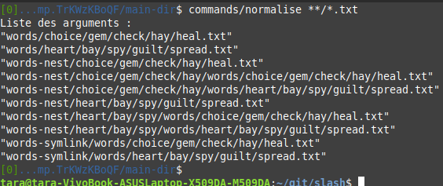
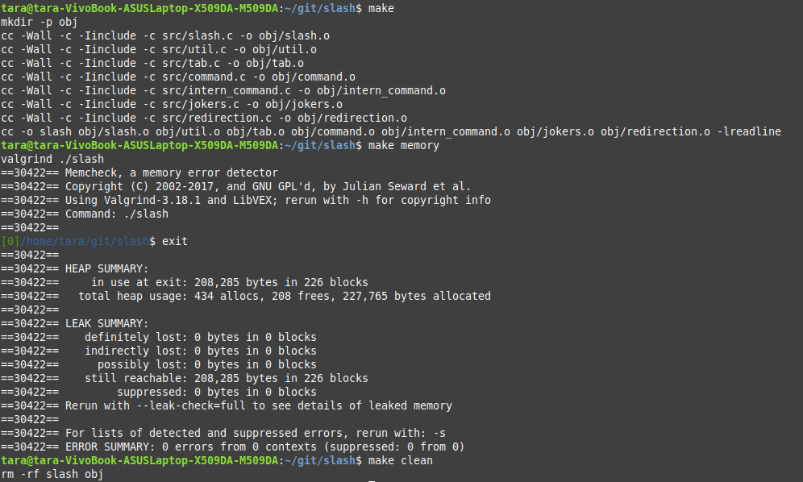
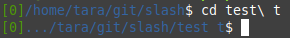

# PROJET SLASH SYS 5 2022-2023

## Sommaire

1. [Introduction et informations](README.md#introduction-et-informations)
2. [Compilation et Exection du projet](README.md#compilation-et-execution-du-projet)
3. [Fonctionalite](README.md#fonctionnalites)
4. [Projet en photos](README.md#projet-en-photos)

----------------------------------------------------------------------

## Introduction et informations

Le but du projet est de programmer un interpréteur de commandes (aka
*shell*) interactif reprenant quelques fonctionnalités plus ou moins
classiques des shells usuels

**Informations généraux**

- Le sujet du projet : [projet.md](documentation/projet.md)
- Le fichier authors : [AUTHORS.md](AUTHORS.md)
- Le fichier architecture : [ARCHITECTURE.md](ARCHITECTURE.md)

----------------------------------------------------------------------

## Compilation et Execution du projet

**Compilation**

Pour compiler le projet, il suffit d'entrer la commande suivante :

```
make
```

Pour supprimer les fichiers .o et l'exécutables :

```
make clean
```

Pour tester valgrind :

```
make memory
```

**Execution**

Pour exécuter le shell :

```
./slash
```

----------------------------------------------------------------------

## Fonctionnalites

**Commandes Internes**

Depuis `slash` vous pouvez executé 3 commandes internes :

 - `exit [val]` : Termine le processus avec la valeur `val`.
    - Si val n'est pas donnée termine avec la valeur de retour de la derniere commande executé.
    
 - `pwd [-L | -P]` : Affiche une référence absolue du répertoire de travail courant.
    - `-P`: sa référence absolue physique. (pas de lien symbolique)
    - `-L`: (option par défaut), sa référence absolue logique.
  
 - `cd [-L | -P] [ref | -]` : Change de répertoire de travail courant en le répertoire `ref`, le précédent répertoire de travail si le paramètre est `-`, ou `$HOME` en l'absence de paramètre. 
    - `-P`: ref est interprétée au regard de la structure physique de l'arborescence.
    - `-L`: (option par défaut), ref est interprétée de manière logique si cela a du sens, et de manière physique sinon.

Toute les commandes internes ont comme valeur de retour est `0` en cas de succès, `1` en cas d'échec.

**Commandes Externes**

`Slash` peut exécuter toutes les commandes externes.
   - Attention : Il ne peut pas exécuté plus de `MAX_ARGS_NUMBER` arguments qui ne font pas plus de `MAX_ARGS_STRLEN` caracteres.
      - `MAX_ARGS_NUMBER` = `MAX_ARGS_STRLEN` = 4096

**Joker**

`Slash réalise l'expansion des jokers suivants :
   - `*`  : tout préfixe d'un nom de base
   - `**` : tout préfixe de chemin physique de la forme `*/*/.../` formé d'au moins une composante
   
**Redirection**

`Slash` gère les redirections suivantes :

- `cmd < fic` : redirection de l'entrée standard de la commande `cmd` sur
  le fichier `fic`

- `cmd > fic` : redirection de la sortie standard de la commande `cmd`
  sur le fichier `fic` sans écrasement

- `cmd >| fic` : redirection de la sortie standard de la commande `cmd`
  sur le fichier `fic` avec écrasement éventuel

- `cmd >> fic` : redirection de la sortie standard de la commande `cmd`
  sur le fichier `fic` en concaténation

- `cmd 2> fic` : redirection de la sortie erreur standard de la commande
  `cmd` sur le fichier `fic` sans écrasement

- `cmd 2>| fic` : redirection de la sortie erreur standard de la commande
  `cmd` sur le fichier `fic` avec écrasement éventuel

- `cmd 2>> fic` : redirection de la sortie erreur standard de la commande
  `cmd` sur le fichier `fic` en concaténation

- `cmd1 | cmd2` : redirection de la sortie standard de `cmd1` et de
  l'entrée standard de `cmd2` sur un même tube anonyme

**Sensibilité aux signaux**

`Slash` ignore les signaux `SIGINT` et `SIGTERM`.

**Extention**

Si le caractere '\' est mis avant un ' ' ou un '|' il sera ignorer pendant le parsing. 

----------------------------------------------------------------------

## Projet en photos








